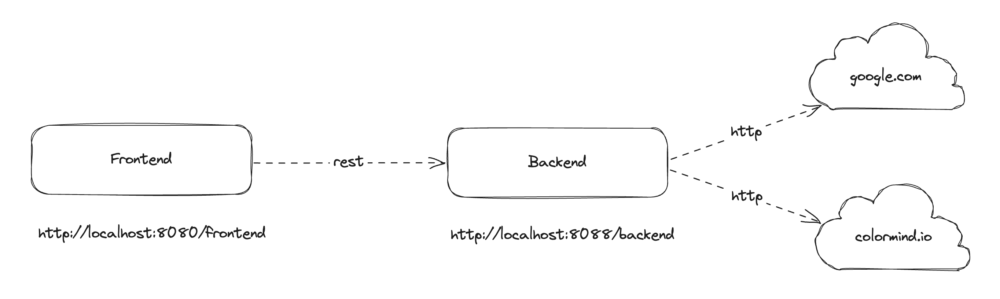
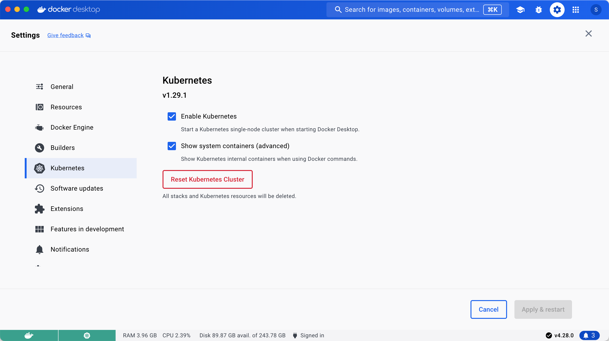
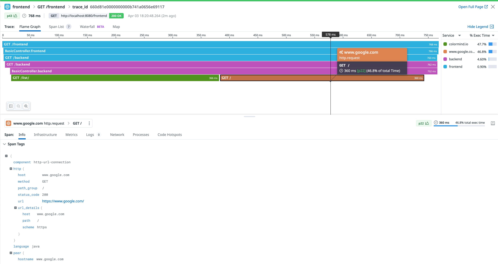
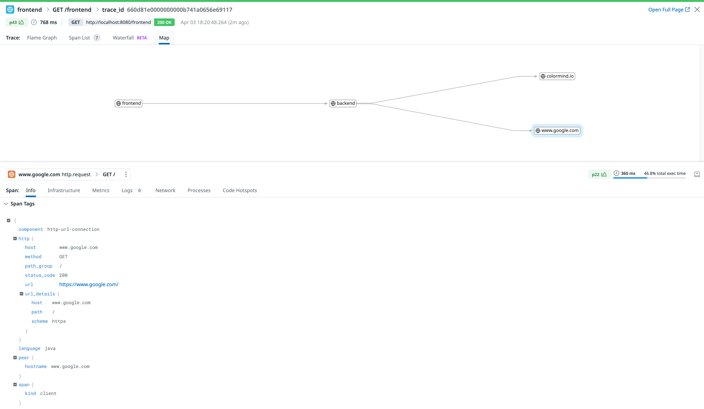
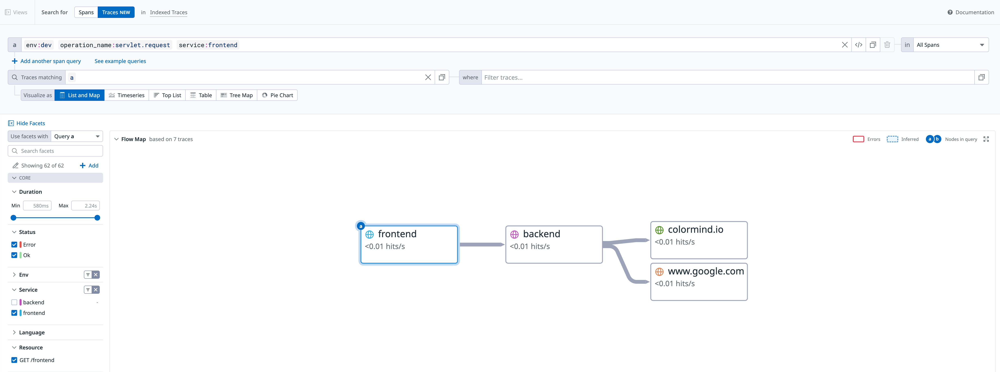
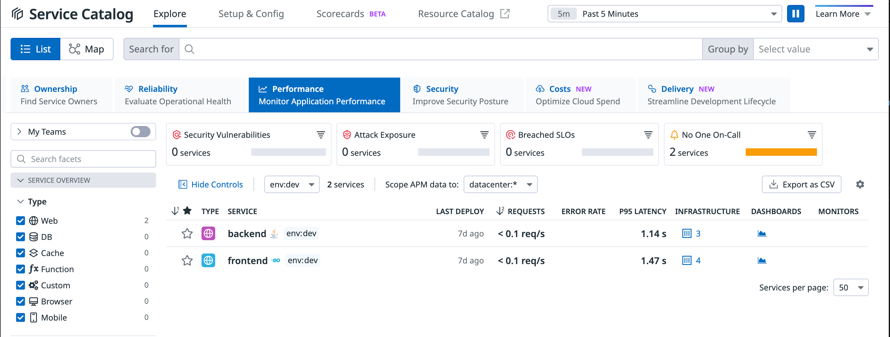

# Instrumenting a sample application using Datadog Operator and Admission Controller on K8s


## Introduction


The sections of this tutorial are structured as follows

* Goal
* Pre-requisites
* Clone the repository
* Directory structure of the [project](#project)
* Overview of the [application](#app)
* Building the application and running it [locally](#local).
* Testing the application and generating [load](#load)
* Building the docker images.
* Building the application and running it on a [kubernetes](#k8s) cluster
* Visualizing data in Datadog
* Clean up the environment 
* End

In each section, we'll describe the required steps to take in order to reach the goal.


## Goal of this lab


The purpose of this lab is to help familiarizing and practising the various steps required to set up a spring boot application using Rest and start instrumenting it with Datadog

<p align="left">
  
</p>


## Pre-requisites


+ About 30 minutes
+ A java JDK (If building & running locally). Ex OpenJDK 11 or above
+ Gradle installed (If building & running locally). Ex Gradle 8.7
+ Git client
+ Your favorite text editor or IDE (Ex Sublime Text, Atom, vscode...)
+ Docker Desktop with a local K8s cluster or any alternative such as kind, k0s, k3s, MicroK8s, Minikube, etc
+ Kubernetes v1.20+
+ Helm for deploying the Datadog Operator
+ Kubectl CLI for installing the Datadog Agent
+ A Datadog account with a valid API key
+ Datadog Operator v.1.5.0+


## Clone the repository


<pre style="font-size: 12px">
git clone https://github.com/smazzone/sampleapp
cd sampleapp

</pre>


## Directory structure of the <a name="project"></a>project

TO BE REFRESHED

The example below is the structure after having clone the project.

```shell
tree
.
├── Dockerfiles
│   ├── Dockerfile.backend
│   └── Dockerfile.frontend
├── LICENSE
├── README.md
├── backend
│   ├── build.gradle
│   ├── gradle
│   │   └── wrapper
│   │       ├── gradle-wrapper.jar
│   │       └── gradle-wrapper.properties
│   ├── gradlew
│   ├── settings.gradle
│   └── src
│       └── main
│           ├── java
│           │   └── com
│           │       └── datadog
│           │           └── ste
│           │               └── backend
│           │                   ├── BackendApplication.java
│           │                   ├── BasicController.java
│           │                   ├── Quote.java
│           │                   └── Value.java
│           └── resources
│               ├── application.yml
│               └── quotes.json
├── coredns.yaml
├── frontend
│   ├── build.gradle
│   ├── gradle
│   │   └── wrapper
│   │       ├── gradle-wrapper.jar
│   │       └── gradle-wrapper.properties
│   ├── gradlew
│   ├── settings.gradle
│   └── src
│       └── main
│           ├── java
│           │   └── com
│           │       └── datadog
│           │           └── ste
│           │               └── frontend
│           │                   ├── BasicController.java
│           │                   ├── FrontendApplication.java
│           │                   ├── Quote.java
│           │                   └── Values.java
│           └── resources
│               └── application.yml
├── img
│   ├── figure1.png
│   ├── figure2.png
│   ├── figure3.png
│   ├── figure4.png
│   ├── figure5.png
│   └── figure6.png
└── k8s
    ├── datadog
    │   └── datadog-agent.yaml
    └── depl.yaml

```

## Overview of the <a name="app"></a>application


The main components of this project are two distinct microservices (`frontend` and `backend`) communicating with each other through Rest. The backend service in turn does return random quotes and issues two external http calls  </br>

## Building <a name="local"></a> the application and running it locally.

These steps assume that you have a JDK installed and configured for your environment. This tutorial has been tested with `OpenJDK 21.0.2`.
And you will also need to have gradle installed, the version used in this example is `8.7` 

If you wish to simply run and test the application, you may skip this section and consider the dockerized version of the [application](#docker). The necessary images are provided and available in a `dockerhub` registry. 


### Building and running **backend** ###

````shell
cd backend
[me@instance:~/sampleapp/backend]$ gradle build

BUILD SUCCESSFUL in 10s
[me@instance:~/sampleapp/backend]$ java -jar build/libs/backend.jar --server.port=8088
````

We can check that the service is running by taking a look at standard output.

````shell

  .   ____          _            __ _ _
 /\\ / ___'_ __ _ _(_)_ __  __ _ \ \ \ \
( ( )\___ | '_ | '_| | '_ \/ _` | \ \ \ \
 \\/  ___)| |_)| | | | | || (_| |  ) ) ) )
  '  |____| .__|_| |_|_| |_\__, | / / / /
 =========|_|==============|___/=/_/_/_/
 :: Spring Boot ::                (v3.2.4)

2024-04-03 12:51:34 [main] INFO  c.d.ste.backend.BackendApplication -   - Starting BackendApplication v0.0.1-SNAPSHOT using Java 21.0.2 with PID 80619 (/Users/stefano.mazzone/dev/sampleapp/backend/build/libs/backend.jar started by stefano.mazzone in /Users/stefano.mazzone/dev/sampleapp/backend)
2024-04-03 12:51:34 [main] INFO  c.d.ste.backend.BackendApplication -   - No active profile set, falling back to 1 default profile: "default"
2024-04-03 12:51:35 [main] INFO  o.s.b.w.e.tomcat.TomcatWebServer -   - Tomcat initialized with port 8088 (http)
2024-04-03 12:51:35 [main] INFO  o.a.catalina.core.StandardService -   - Starting service [Tomcat]
2024-04-03 12:51:35 [main] INFO  o.a.catalina.core.StandardEngine -   - Starting Servlet engine: [Apache Tomcat/10.1.19]
2024-04-03 12:51:35 [main] INFO  o.a.c.c.C.[Tomcat].[localhost].[/] -   - Initializing Spring embedded WebApplicationContext
2024-04-03 12:51:35 [main] INFO  o.s.b.w.s.c.ServletWebServerApplicationContext -   - Root WebApplicationContext: initialization completed in 524 ms
2024-04-03 12:51:35 [main] INFO  o.s.b.w.e.tomcat.TomcatWebServer -   - Tomcat started on port 8088 (http) with context path ''
2024-04-03 12:51:35 [main] INFO  c.d.ste.backend.BackendApplication -   - Started BackendApplication in 1.081 seconds (process running for 1.388)
2024-04-03 12:51:35 [main] INFO  c.d.ste.backend.BackendApplication -   - test

````

The service is started and listens on port `8088` and exposes an endpoint `/backend` that will be hit by the `frontend` service. 
Let's now build and test `frontend`. You can open a different terminal.


### Building and running **frontend** ###

````shell
[me@instance:~/sampleapp/frontend]$ gradle build

BUILD SUCCESSFUL in 7s
[me@instance:~/sampleapp/frontend]$ java -jar build/libs/frontend.jar


  .   ____          _            __ _ _
 /\\ / ___'_ __ _ _(_)_ __  __ _ \ \ \ \
( ( )\___ | '_ | '_| | '_ \/ _` | \ \ \ \
 \\/  ___)| |_)| | | | | || (_| |  ) ) ) )
  '  |____| .__|_| |_|_| |_\__, | / / / /
 =========|_|==============|___/=/_/_/_/
 :: Spring Boot ::                (v3.2.4)

2024-04-03 13:06:27 [main] INFO  c.d.ste.frontend.FrontendApplication -   - Starting FrontendApplication v0.0.1-SNAPSHOT using Java 21.0.2 with PID 9343 (/Users/stefano.mazzone/dev/sampleapp/frontend/build/libs/frontend.jar started by stefano.mazzone in /Users/stefano.mazzone/dev/sampleapp/frontend)
2024-04-03 13:06:27 [main] INFO  c.d.ste.frontend.FrontendApplication -   - No active profile set, falling back to 1 default profile: "default"
2024-04-03 13:06:27 [main] INFO  o.s.b.w.e.tomcat.TomcatWebServer -   - Tomcat initialized with port 8080 (http)
2024-04-03 13:06:28 [main] INFO  o.a.catalina.core.StandardService -   - Starting service [Tomcat]
2024-04-03 13:06:28 [main] INFO  o.a.catalina.core.StandardEngine -   - Starting Servlet engine: [Apache Tomcat/10.1.19]
2024-04-03 13:06:28 [main] INFO  o.a.c.c.C.[Tomcat].[localhost].[/] -   - Initializing Spring embedded WebApplicationContext
2024-04-03 13:06:28 [main] INFO  o.s.b.w.s.c.ServletWebServerApplicationContext -   - Root WebApplicationContext: initialization completed in 479 ms
2024-04-03 13:06:28 [main] INFO  o.s.b.w.e.tomcat.TomcatWebServer -   - Tomcat started on port 8080 (http) with context path ''
2024-04-03 13:06:28 [main] INFO  c.d.ste.frontend.FrontendApplication -   - Started FrontendApplication in 1.02 seconds (process running for 1.346)
2024-04-03 13:06:28 [main] INFO  c.d.ste.frontend.FrontendApplication -   - Initial call
````

The service is started and listens on port `8080`. And exposes an `/frontend` endpoint. We can quickly check that the communication takes place by issuing  curl command to hit the `/frontend` endpoint exposed by `frontend`

## Testing the application and generating <a name="load"></a>load

We can do that by running a few curl commands on `/frontend`.

````shell
curl localhost:8080/frontend
````

You will get something similar to:
````shell
Quote{type='success', values=Values{id=6, quote='Alea jacta est'}}
````

## Building the docker <a name="docker"></a> images.

### Building the images ###

For the sake of effectiveness, you will find the required images preloaded into the following registry https://hub.docker.com/repositories/smazzone therefore you may skip the rest of this section and go to the next section if you only need to run the application. 

On the other hand, if you want to build your own images, if you want to change/adapt the services, dockerfiles and rebuild/push the images yourself, you may consider the following steps:

* Build the application components (`frontend`,`backend`) as described in the previous [section](#local). 

* Build the docker images as shown below and relies on docker commands:

````shell
docker build -f Dockerfiles/Dockerfile.frontend -t <your user>/frontend:v2 .
...
docker build -f Dockerfiles/Dockerfile.backend -t <your user>/backend:v2 .
...
docker login -u=<your user> -p=xxxxxxxxxxx
...
docker push <your user>/frontend:v2
...
docker push <your user>/backend:v2
...

````
</br>


## Building <a name="k8s"></a> the application and running it on a kubernetes cluster


### Building the K8s cluster on Docker Desktop ###

Creating a cluster in Docker Desktop just requires a few clicks:

* From the Docker Dashboard, select the Settings.
* Select Kubernetes from the left sidebar.
* Next to Enable Kubernetes, select the checkbox.
* Select Apply & Restart to save the settings and then select Install to confirm.


<p align="left">
  
</p>

You can verify you K8s cluster with the following command:

````shell

kubectl get nodes

````

You will get something similar to:


````shell
NAME             STATUS   ROLES           AGE    VERSION
docker-desktop   Ready    control-plane   141d   v1.28.2

````


### Deploying the Datadog Operator on K8s###

We can now instrument our application to get deep visibility.
Let us start installing the Datadog Operator with Helm:

````shell
helm repo add datadog https://helm.datadoghq.com
helm install my-datadog-operator datadog/datadog-operator
````

This confirms we have deployed the Datadog Operator:

````shell
NAME: my-datadog-operator
LAST DEPLOYED: Fri Apr  5 10:27:14 2024
NAMESPACE: default
STATUS: deployed
REVISION: 1
TEST SUITE: None
NOTES:
````

We are now going to create a Kubernetes secret with your API and application keys:
Let us make sure to replace <DATADOG_API_KEY> and <DATADOG_APP_KEY> with your Datadog API and application keys.

````shell
kubectl create secret generic datadog-secret --from-literal api-key=<DATADOG_API_KEY> --from-literal app-key=<DATADOG_APP_KEY>
````

Let us now create a datadog-agent.yaml file with the specs of our Datadog Agent deployment configuration. The configuration I have used here enables APM, metrics and logs. You can check  all configuration options in the
[Operator configuration spec](https://github.com/DataDog/datadog-operator/blob/main/docs/configuration.v2alpha1.md).

````shell
apiVersion: datadoghq.com/v2alpha1
kind: DatadogAgent
metadata:
  name: datadog
spec:
  global:
    clusterName: docker-desktop
    kubelet:
      tlsVerify: false
    tags:
      - env:dev
    credentials:
      apiSecret:
        secretName: datadog-secret
        keyName: api-key
      appSecret:
        secretName: datadog-secret
        keyName: app-key
  features:
    apm:
      instrumentation:
      enabled: true
        enabledNamespaces:
          - apps
        libVersions:
          java: v1.32.0
    logCollection:
      enabled: true
      containerCollectAll: true
    remoteConfiguration:
      enabled: true
````


As you can see with just three lines we were able to enable APM instrumentation, limit the scope to specific namespace(s) and specify the tracing library version at the cluster level.

By the way, when apm.instrumentation.libVersions is set, only the specified libraries and versions are injected.

Rest assured that you can also specify the library version at the service level, using the appropriate annotation for your language within your pod spec. You can find more information [here.](https://docs.datadoghq.com/tracing/trace_collection/automatic_instrumentation/single-step-apm/?tab=kubernetes#specifying-at-the-service-level)


It is now time to deploy the Datadog Agent:

````shell
kubectl apply -f k8s/datadog/datadog-agent.yaml
````

You should see the following result:

````shell
datadogagent.datadoghq.com/datadog created
````


### Running the app on K8s ###

It is now time to deploy the application on our K8s cluster. The deployment file we will use is named `depl.yaml`
We will create a separate namespace to host our application.

````shell
kubectl create ns apps
kubectl apply -f k8s/depl.yaml -n apps
````

That's it, we have now our application running in K8s within two pods. 

We can check the pods are running with the following command:

````shell
kubectl get pods -n apps
````
You should see something similar to:

````shell
NAME                        READY   STATUS    RESTARTS   AGE
backend-6b4d65b76b-79bjb    1/1     Running   0          2m
frontend-8555c79d7d-8fhcn   1/1     Running   0          2m
````

The Datadog Operator and the Admission controller will now instrument our app with the required tracing library as defined in our datadog-agent.yaml.  

To check if this is happening we can inspect our pod. You should use your pod name in the command below:

````shell
kubectl describe pod frontend-8555c79d7d-8fhcn -n apps
````

You can see an init-container has been added to our pod. This container includes the Datadog Java tracing libraries to a volume mount.

````shell
datadog-lib-java-init:
    Container ID:  docker://c7d47e929000b6019218487ff8cc754e453b185ef1debe220909c404bd7bb0b0
    Image:         gcr.io/datadoghq/dd-lib-java-init:v1.32.0
````

````shell
Mounts:
  /datadog-lib from datadog-auto-instrumentation (rw)
````

Also ````JAVA_TOOL_OPTIONS```` has been updated to include javaagent and last but not least, Datadog specific environment variables have been added to the container:


````shell

Environment:
  DD_TRACE_RATE_LIMIT:              100
  DD_TRACE_SAMPLE_RATE:             1.00
  DD_RUNTIME_METRICS_ENABLED:       true
  DD_TRACE_HEALTH_METRICS_ENABLED:  true
  DD_LOGS_INJECTION:                true
  DD_TRACE_ENABLED:                 true
  DD_SERVICE:                       frontend
  DD_INSTRUMENTATION_INSTALL_TYPE:  k8s_single_step
  DD_INSTRUMENTATION_INSTALL_ID:    6d6c70b9-5669-450f-a6e0-9fbda2efce4a
  DD_INSTRUMENTATION_INSTALL_TIME:  1712746671
  DD_ENTITY_ID:                      (v1:metadata.uid)
  DD_DOGSTATSD_URL:                 unix:///var/run/datadog/dsd.socket
  DD_TRACE_AGENT_URL:               unix:///var/run/datadog/apm.socket
  URL:                              http://backend:8088
  JAVA_TOOL_OPTIONS:                 -javaagent:/datadog-lib/dd-java-agent.jar -XX:OnError=/datadog-lib/continuousprofiler/tmp/dd_crash_uploader.sh -XX:ErrorFile=/datadog-lib/continuousprofiler/tmp/hs_err_pid_%p.log
````


## Visualizing data in Datadog ##

We can check that our services are being instrumented and that the details are reflected in this trace flamegraph. 

<p align="left">
  
</p>

</br>

Besides, we can also visualize the topology representation of this call

<p align="left">
  
</p>

Also, we can visualize the flow map representation of this call

<p align="left">
  
</p>

And last but not least, we can see the two services reporting under the Service Catalog

<p align="left">
  
</p>

## Clean up the environment ##

You can undeploy the app with the following commands:

````shell
kubectl delete -f k8s/depl.yaml -n apps
kubectl delete namespace apps
````

You can delete the datadog agent with the following command:

````shell
kubectl delete -f k8s/datadog/datadog-agent.yaml
````
You can delete the datadog operator with the following command:

````shell
helm uninstall my-datadog-operator
````

## End
